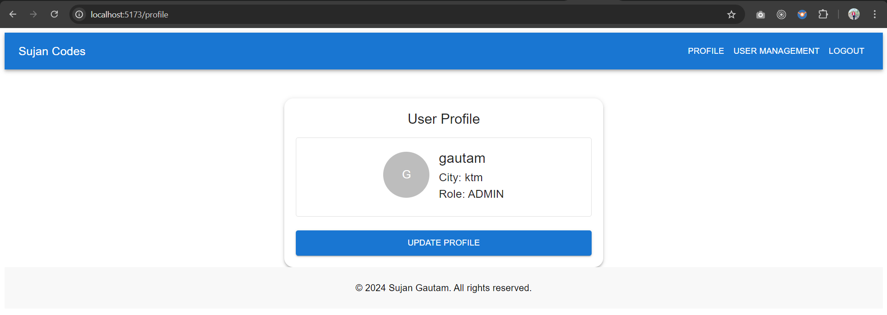
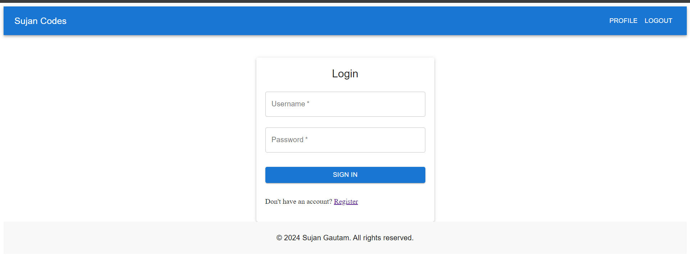

# User Management Portal - Frontend

This repository contains the frontend for the User Management Portal built using **React** and **Vite**. It allows users to log in, view/update profiles, and provides admin access to manage other users.

For the backend implementation, check out the
[User Management Portal Backend](https://github.com/sujan66root/user-management-portal) repository.






## 🛠️ Features

- **Login/Registration**: User authentication via API calls to the backend.
- **Role-based Access**: Conditional rendering of user management features based on user roles.
- **Profile Management**: Users can view and update profile information.
- **User Management Dashboard**: Admins can perform CRUD operations on users.
- **Persistent State**: Uses `localStorage` to store tokens and roles.

## 🚀 Tech Stack

- **React**
- **Axios** for HTTP requests
- **Material UI** for UI components
- **React Router** for routing
- **JWT** for authentication

## 🔧 Setup Instructions

1. Clone the repository:
   ```bash
   git clone https://github.com/your-username/user-management-frontend.git
   ```
